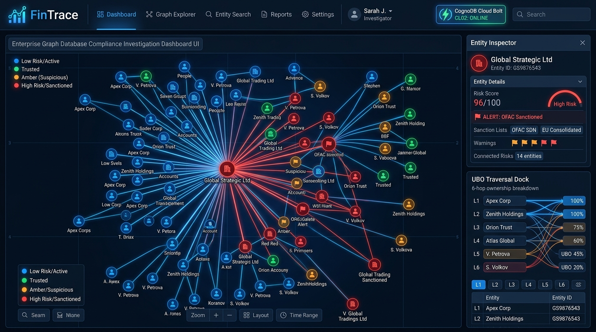
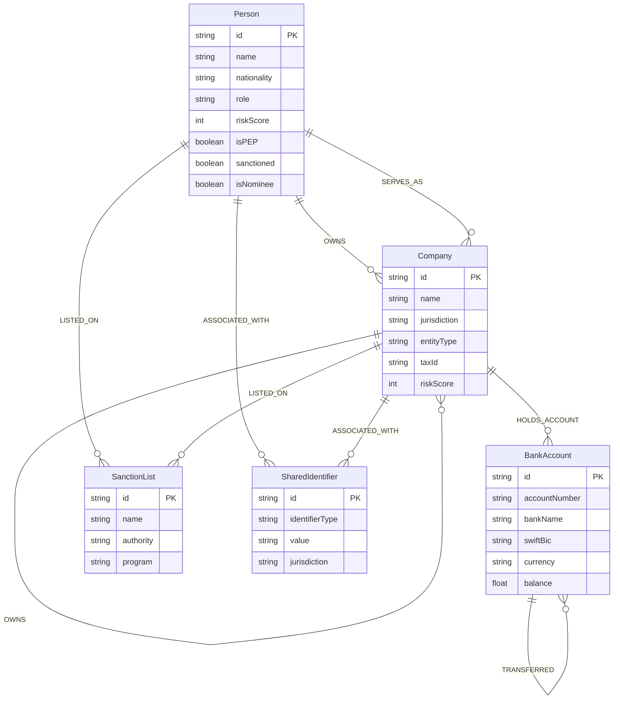

# FinTrace: Graph Intelligence Platform for UBO & Financial Crime Forensics

> **Take-Home Assessment for Wexa AI** — Built on **CognoDB** (openCypher over Bolt Protocol) using the official `neo4j-driver`.



---

## 1. Executive Summary & Use Case

**FinTrace** is an enterprise-grade forensic investigation platform designed for Anti-Money Laundering (AML) compliance officers, financial intelligence units (FIUs), and forensic auditors. 

In real-world compliance (FATF recommendations, FinCEN regulations, EU 6AMLD, Corporate Transparency Act), bad actors obscure illegal proceeds and ownership behind layered multi-jurisdictional shell companies, strawmen nominee directors, and circular transaction webs.

FinTrace models and investigates these complex networks across four core scenarios:
1. **The "Matryoshka" Offshore Holding Pyramid**: A 6-hop indirect corporate ownership chain in secrecy jurisdictions (Seychelles → Cyprus → Cayman Islands → Jersey → UK) obscuring a sanctioned oligarch's controlling equity.
2. **Circular SWIFT Wash-Trading Loop**: High-velocity circular fund transfers ($9.39M USD) across Zurich, Dubai, Singapore, and BVI bank accounts designed to create fake turnover and wash funds.
3. **The Nominee Director & Mailbox Farm**: A single nominee director and mass-registration mailbox in Road Town, Tortola (BVI) fronting 8 shell companies.
4. **Legitimate Enterprise (Clean Baseline)**: Verified transparent direct ownership structure for comparative benchmarking.

---

## 2. "Why a Graph Database?"

Relational databases (RDBMS) are built for rectangular tabular data. In financial crime investigation, **the connections between data points are first-class citizens**, making relational databases fundamentally ill-suited:

| Investigative Operation | Relational RDBMS (PostgreSQL / MySQL) | CognoDB Graph Database (openCypher) |
| :--- | :--- | :--- |
| **Multi-Hop UBO Discovery (1..6 hops)** | Requires complex `WITH RECURSIVE` CTEs, repeated self-joins, high memory allocation, and hardcoded maximum depths. | Native index-free adjacency traversal: `(p:Person)-[:OWNS*1..6]->(c:Company)`. |
| **Circular Fund Flow (Wash Trading)** | Combinatorial explosion. Detecting cycles of arbitrary length (3 to 6 hops) requires expensive visited-node tracking in SQL. | Instant cycle matching: `MATCH p=(a)-[:TRANSFERRED*3..6]->(a) RETURN p`. |
| **Shortest Path to Sanctions / PEP** | Requires implementing Dijkstra or BFS in application code over multiple sequential table queries. | Built-in native graph algorithm: `shortestPath((start)-[*1..6]-(sanction))`. |
| **Heterogeneous Identity Graphs** | Requires dozens of nullable join tables (`entity_address`, `person_phone`, `company_agent`). | Natural property graph with typed edges (`:ASSOCIATED_WITH`, `:SERVES_AS`). |

### Concrete Query Comparison: UBO Traversal

#### PostgreSQL (Recursive CTE - Fragile, 25+ lines, slow):
```sql
WITH RECURSIVE ownership_chain AS (
    SELECT owner_id, company_id, percentage, 1 AS depth, ARRAY[owner_id] AS path
    FROM company_ownership WHERE company_id = 'comp-kensington-sovereign'
    UNION ALL
    SELECT co.owner_id, co.company_id, (oc.percentage * co.percentage / 100.0), oc.depth + 1, oc.path || co.owner_id
    FROM company_ownership co
    JOIN ownership_chain oc ON co.company_id = oc.owner_id
    WHERE oc.depth < 6 AND NOT co.owner_id = ANY(oc.path)
)
SELECT p.name AS ultimate_owner, SUM(oc.percentage) AS effective_pct
FROM ownership_chain oc
JOIN persons p ON p.id = oc.owner_id
GROUP BY p.name;
```

#### CognoDB (openCypher - Clean, declarative, lightning-fast):
```cypher
MATCH path = (ubo:Person)-[rels:OWNS*1..6]->(target:Company {id: $targetCompanyId})
WITH ubo, target, path, rels,
     reduce(acc = 1.0, r IN rels | acc * (toFloat(coalesce(r.percentage, 100.0)) / 100.0)) * 100.0 AS effectiveOwnershipPct
RETURN ubo.name AS UltimateOwner, target.name AS Target, effectiveOwnershipPct, length(path) AS HopCount
ORDER BY effectiveOwnershipPct DESC;
```

---

## 3. Graph Data Model

### Entity-Relationship Diagram



### Node Labels & Properties
| Label | Description | Key Properties |
| :--- | :--- | :--- |
| `:Person` | Beneficial owners, directors, PEPs, nominees | `id`, `name`, `nationality`, `role`, `riskScore`, `isPEP`, `sanctioned`, `isNominee` |
| `:Company` | Offshore shells, operating corps, SPVs, LLCs | `id`, `name`, `jurisdiction`, `entityType`, `taxId`, `riskScore`, `tags` |
| `:BankAccount` | SWIFT bank accounts tied to fund transfers | `id`, `accountNumber`, `bankName`, `swiftBic`, `currency`, `balance` |
| `:SanctionList` | Watchlists (OFAC SDN, EU Asset Freeze) | `id`, `name`, `authority`, `program`, `datePublished` |
| `:SharedIdentifier` | Mass mailboxes, virtual phone numbers | `id`, `identifierType`, `value`, `jurisdiction`, `isKnownShellMailbox` |

### Typed Relationships & Properties
| Relationship | Start Node → End Node | Properties |
| :--- | :--- | :--- |
| `[:OWNS]` | `:Person\|Company` → `:Company` | `percentage` (Float), `shareClass`, `since`, `votingRights` |
| `[:SERVES_AS]` | `:Person` → `:Company` | `role` ('Director', 'Nominee', 'CEO'), `appointed` |
| `[:TRANSFERRED]` | `:BankAccount` → `:BankAccount` | `amount` (Float), `currency`, `date`, `txHash`, `invoiceRef`, `flagged` |
| `[:HOLDS_ACCOUNT]` | `:Company` → `:BankAccount` | `openedDate`, `authorizedSignatory` |
| `[:LISTED_ON]` | `:Person\|Company` → `:SanctionList` | `listType`, `reason`, `dateListed`, `legalBasis` |
| `[:ASSOCIATED_WITH]`| `:Person\|Company` → `:SharedIdentifier`| `associationType` ('REGISTERED_OFFICE', 'CORPORATE_PHONE') |

---

## 4. Main Cypher Queries Explained

All Cypher queries in FinTrace are **strictly parameterized** via the official Neo4j driver (zero string concatenation).

### 1. Multi-Hop Effective Beneficial Ownership (UBO)
Traverses 1 to 6 hops of nested holding entities, multiplying intermediate equity stakes to identify ultimate human controllers exceeding statutory AML thresholds (e.g. 25%).
```cypher
MATCH path = (ubo:Person)-[rels:OWNS*1..6]->(target:Company {id: $targetCompanyId})
WITH ubo, target, path, rels,
     reduce(acc = 1.0, r IN rels | acc * (toFloat(coalesce(r.percentage, 100.0)) / 100.0)) * 100.0 AS effectiveOwnershipPct
RETURN ubo, target, path, effectiveOwnershipPct, length(path) AS hopCount,
       [n IN nodes(path) | coalesce(n.name, n.id)] AS chainNames,
       [r IN rels | r.percentage] AS stepPercentages
ORDER BY effectiveOwnershipPct DESC;
```

### 2. Circular SWIFT Money Laundering / Wash-Trading Loops
Detects closed cycles of transfers where funds return to origin accounts within 3 to 6 hops:
```cypher
MATCH path = (origin:BankAccount)-[txs:TRANSFERRED*3..6]->(origin)
WITH origin, path, txs,
     reduce(total = 0.0, tx IN txs | total + toFloat(coalesce(tx.amount, 0.0))) AS totalVolume,
     length(path) AS loopLength
RETURN origin, path, nodes(path) AS involvedAccounts, txs AS transactions, totalVolume, loopLength
LIMIT 10;
```

### 3. Native Shortest Path to Sanctioned Entities
Calculates the minimum degrees of separation linking any subject commercial entity to global sanctions watchlists:
```cypher
MATCH (start {id: $startEntityId}), (sanction:SanctionList)
MATCH p = shortestPath((start)-[*1..6]-(sanction))
RETURN p, length(p) AS distance, nodes(p) AS pathNodes, relationships(p) AS pathEdges
ORDER BY distance ASC
LIMIT 5;
```

### 4. Nominee Director & Mass Mailbox Farm Aggregation
Identifies synthetic registration hubs where single addresses or strawmen directors front multiple shell companies:
```cypher
MATCH (hub)<-[rel:SERVES_AS|ASSOCIATED_WITH]-(comp:Company)
WHERE hub:Person OR hub:SharedIdentifier
WITH hub, collect(comp) AS companies, count(comp) AS companyCount, collect(rel) AS rels
WHERE companyCount >= $threshold
RETURN hub, companies, companyCount, rels
ORDER BY companyCount DESC;
```

---

## 5. Quick Start & Setup Guide

### Prerequisites
- Node.js (v18 or higher)
- npm (v9 or higher)

### 1. Clone & Install Dependencies
```bash
# Clone the repository
git clone https://github.com/<your-username>/fintrace-graph-intelligence.git
cd fintrace-graph-intelligence

# Install Backend Dependencies
cd backend
npm install

# Install Frontend Dependencies
cd ../frontend
npm install
```

### 2. CognoDB Cloud Setup (Takes < 1 minute)
1. Sign up for a free account at [https://console.cognodb.com/signup](https://console.cognodb.com/signup) (no credit card required).
2. Create a free **(c0)** instance in your preferred region.
3. Copy the generated **Bolt Connection URI** (`bolt+s://<instance-id>.databases.cognodb.cloud`) and **password** for user `cognodb`.
4. Configure `backend/.env`:
```env
COGNODB_URI=bolt+s://<your-instance-id>.databases.cognodb.cloud
COGNODB_USER=cognodb
COGNODB_PASSWORD=<your-generated-password>
PORT=5000
NODE_ENV=development
```

### 3. Seed CognoDB Database
Run the included seed script to populate the database with the realistic forensic dataset:
```bash
cd backend
npm run seed
```

*Output:*
```
═══════════════════════════════════════════════════════════
  FinTrace Graph Intelligence — CognoDB Cloud Data Seeder  
═══════════════════════════════════════════════════════════
📡 Connecting to CognoDB at: bolt+s://***.databases.cognodb.cloud
✅ Connection verified via Bolt 5.x protocol.
🧹 Clearing old graph data (DETACH DELETE)...
⚡ Creating uniqueness constraints & indexes...
📥 Ingesting Nodes...
   + Created 4 (:Person) nodes
   + Created 18 (:Company) nodes
   + Created 2 (:SanctionList) nodes
   + Created 5 (:BankAccount) nodes
   + Created 2 (:SharedIdentifier) nodes
🔗 Ingesting Typed Relationships...
   + Created 9 [:OWNS] edges
   + Created 10 [:SERVES_AS] edges
   + Created 4 [:TRANSFERRED] edges
   + Created 5 [:HOLDS_ACCOUNT] edges
   + Created 2 [:LISTED_ON] edges
   + Created 8 [:ASSOCIATED_WITH] edges
🎉 Database seeding completed successfully!
```

### 4. Run the Application
Start the backend and frontend dev servers:

```bash
# Terminal 1: Start Backend API (Port 5000)
cd backend
npm run dev

# Terminal 2: Start Frontend UI (Port 5173)
cd frontend
npm run dev
```

Open [http://localhost:5173](http://localhost:5173) in your browser.

> **Resilient Offline Mock Mode:** If you do not configure CognoDB credentials immediately, FinTrace automatically starts in offline mock mode with built-in in-memory graph analytics fallback so all UI workflows, UBO algorithms, and visualisations remain fully interactive and testable.

---

## 6. Project Structure

```
fintrace-graph-intelligence/
├── backend/
│   ├── src/
│   │   ├── config/
│   │   │   └── db.js            # Neo4j/CognoDB driver singleton, TLS, pool & healthcheck
│   │   ├── data/
│   │   │   ├── realisticDataset.js # Curated 4-scenario forensic AML dataset
│   │   │   └── seed.js          # Standalone CLI Seeder using parameterized openCypher
│   │   ├── services/
│   │   │   ├── cypherQueries.js # Strictly parameterized Cypher queries
│   │   │   └── graphService.js  # Service layer with CognoDB execution & mock fallback
│   │   ├── controllers/
│   │   │   └── graphController.js # REST API controllers
│   │   ├── routes/
│   │   │   └── api.js           # Express API route bindings
│   │   └── server.js            # Express server entry point
│   ├── .env.example
│   └── package.json
├── frontend/
│   ├── src/
│   │   ├── components/
│   │   │   ├── Navbar.jsx       # Header with scenario presets & Bolt status badge
│   │   │   ├── GraphCanvas.jsx  # Interactive force-directed canvas graph renderer
│   │   │   ├── EntityInspector.jsx # Side drawer with risk scoring & connected edges
│   │   │   ├── InvestigationPanel.jsx # UBO, Wash-trading, Sanctions & Cypher tabs
│   │   │   └── ConnectionModal.jsx # Step-by-step CognoDB Cloud setup modal
│   │   ├── utils/
│   │   │   └── api.js           # Frontend API client
│   │   ├── App.jsx              # Application state orchestrator
│   │   ├── index.css            # Dark glassmorphic design system
│   │   └── main.jsx
│   ├── index.html
│   ├── vite.config.js
│   └── package.json
├── docs/
│   └── dashboard-preview.jpg
└── README.md
```

---

## 7. Submission Checklist for Wexa AI

- [x] Backed by **CognoDB** (openCypher over Bolt 5.x protocol).
- [x] Official `neo4j-driver` used with **parameterized queries** (no string concatenation).
- [x] Thoughtful graph data model documented with Mermaid diagrams.
- [x] Realistic seed data loaded via included `seed.js` script.
- [x] Multi-hop traversal (6 hops) and circular loop detection queries implemented.
- [x] "Why a graph database?" detailed justification with SQL comparison.
- [x] Intuitive, high-polish UI/UX for non-technical users.
- [x] Secrets and connection strings managed securely via `.env`.
- [x] Graceful error handling and offline fallback when database is unreachable.

---

## 8. License

MIT License. Designed & developed for the Wexa AI Take-Home Assessment.
